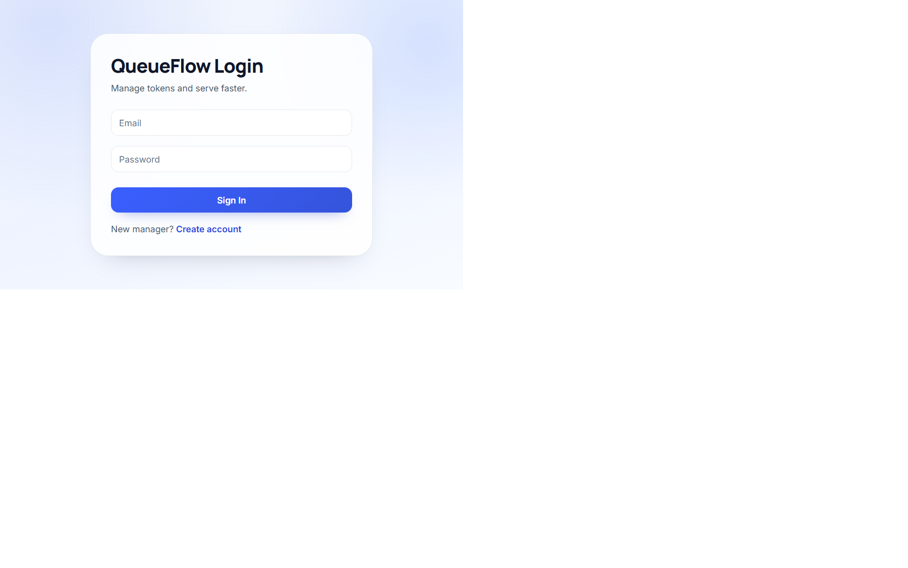
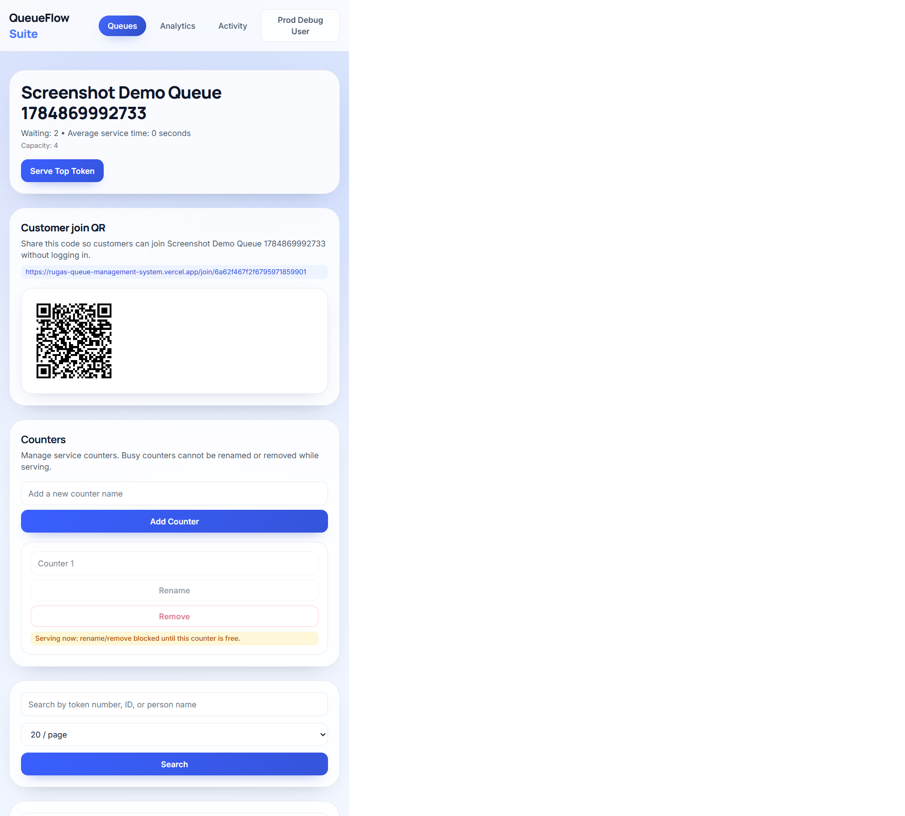
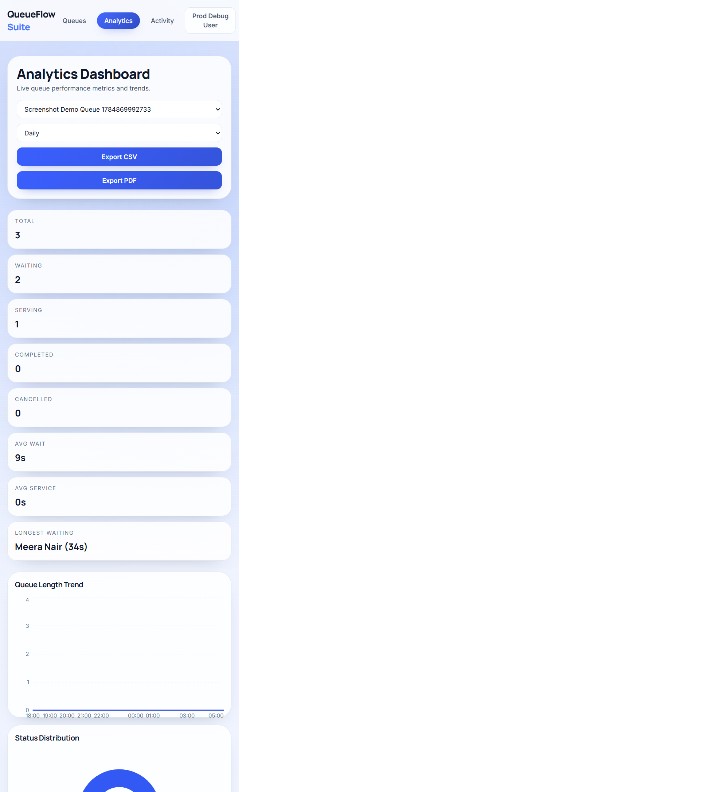
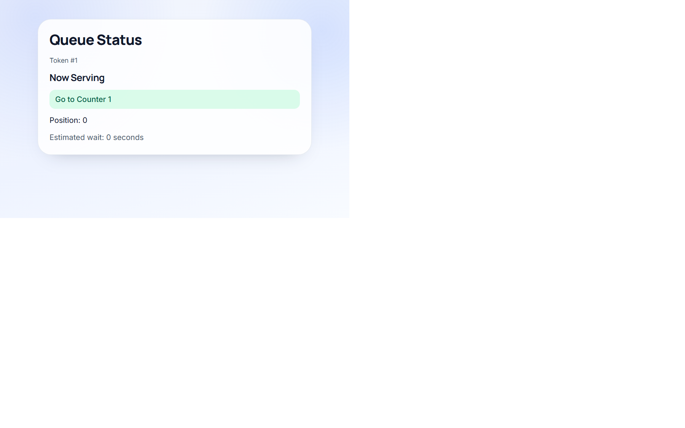

# QueueFlow Suite

A production-style real-time queue management platform for service desks, with manager operations, public self-service joining, and live tracking.

## Core Features

- Real-time queue operations with Socket.io (add, serve, complete, cancel, undo)
- Priority insertion (emergency, VIP, senior citizen, normal)
- Drag-and-drop reorder for waiting tokens
- Multi-counter support with automatic counter assignment while serving
- Public no-login join and live token tracking
- Browser notifications on public tracking ("next in line" and "now serving")
- Analytics dashboard (summary, trends, status mix, hourly traffic)
- Gemini-powered AI insights
- CSV/PDF report exports
- Activity logs for manager actions
- Queue archive/unarchive controls
- Dark/light theme toggle

## Tech Stack

- Backend: Node.js, Express, MongoDB Atlas (Mongoose), Socket.io
- Frontend: React, Vite, Tailwind CSS, Recharts
- Auth/Security: JWT, route protection, validation middleware, rate limiting
- AI: Google Gemini integration for analytics insight summaries

## Live Demo

- Frontend (Vercel): https://rugas-queue-management-system.vercel.app
- Backend (Render): https://queueflow-backend-fk17.onrender.com
- Repository: https://github.com/techWithKeerthana/rugas-queue-management-system

## Architecture (High Level)

QueueFlow has two surfaces: an authenticated manager dashboard for queue operations and analytics, and a public no-login flow for queue joining and token tracking. The backend handles business rules and persistence, while Socket.io broadcasts real-time state updates to manager and public tracking clients.

## Run Locally

1. Install dependencies.

```bash
npm install
npm install --prefix backend
npm install --prefix frontend
```

2. Configure required environment variables.

Backend (required names):

- PORT
- MONGO_URI
- JWT_SECRET
- JWT_EXPIRES_IN
- FRONTEND_ORIGIN
- GEMINI_API_KEY
- GEMINI_MODEL
- INSIGHTS_TIMEOUT_MS

Frontend (required names):

- VITE_API_URL
- VITE_SOCKET_URL

Use the example files as a starting point:

- backend/.env.example
- frontend/.env.example
- frontend/.env.production.example

3. Start both apps from repo root.

```bash
npm run dev
```

Useful commands:

```bash
npm run test --prefix backend
npm run build --prefix frontend
```

## Screenshots








