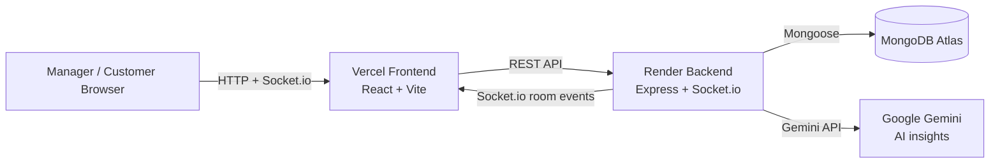

# Queue Management System

Full-stack queue management app for manager workflows and customer queue tracking.

## Live URLs

- Frontend: https://frontend-sand-two-jsq0xwws5z.vercel.app
- Backend: https://queueflow-backend-fk17.onrender.com
- GitHub: https://github.com/techWithKeerthana/rugas-queue-management-system

## Architecture



## Features by Tier

### Tier 1
- JWT auth: register, login, logout, me
- Manager-scoped queues with unique names
- Token lifecycle: waiting, serving, completed, cancelled
- Priority insertion: emergency, vip, senior, normal
- Drag-and-drop reorder for waiting tokens
- Serve top, cancel, complete, undo
- Estimated wait time and live serving timer
- Real-time sync via Socket.io
- Analytics dashboard KPIs and charts
- Seed script and basic app setup

### Tier 2
- Token search by token number, token id, or person name
- Token pagination
- Duplicate active-token detection
- Queue capacity enforcement
- Daily, weekly, monthly report endpoints
- CSV and PDF export
- Dark/light theme toggle
- Profile dropdown with manager info and logout

### Tier 3
- Gemini-backed AI queue insights
- Insight caching with refresh and timeout fallback
- Queue archive and unarchive
- Active, archived, and all queue filtering
- Archived queue mutability guard
- Activity logs with pagination
- Activity logs page

### Public tracking
- Public no-login tracking route: `/track/:queueId/:tokenId`
- Public endpoint: `GET /api/public/track/:queueId/:tokenId`
- Customer-safe fields only
- Rate-limited public access
- Restricted Socket.io invalidation-only refresh path

## Screenshots

All screenshots were taken from the deployed app.

- Login: [docs/screenshots/login.png](docs/screenshots/login.png)
- Queue dashboard: [docs/screenshots/queue-dashboard.png](docs/screenshots/queue-dashboard.png)
- Analytics: [docs/screenshots/analytics.png](docs/screenshots/analytics.png)
- Public tracking: [docs/screenshots/public-track.png](docs/screenshots/public-track.png)

## Setup

Clone the repo, then install dependencies:

```bash
npm install
cd backend
npm install
cd ../frontend
npm install
```

### Required environment variables

Backend:
- `PORT`
- `MONGO_URI`
- `JWT_SECRET`
- `JWT_EXPIRES_IN`
- `FRONTEND_ORIGIN`
- `GEMINI_API_KEY`
- `GEMINI_MODEL`
- `INSIGHTS_TIMEOUT_MS`

Frontend:
- `VITE_API_URL`
- `VITE_SOCKET_URL`

Copy the example files and fill in your local values:
- `backend/.env.example`
- `frontend/.env.example`
- `frontend/.env.production.example`

## Run

Development from repo root:

```bash
npm run dev
```

Backend only:

```bash
npm run dev --prefix backend
```

Frontend only:

```bash
npm run dev --prefix frontend
```

Tests:

```bash
cd backend
npm test
```

Frontend build:

```bash
cd frontend
npm run build
```

## Known Limitations

- Render free tier cold starts can make the first request slower.
- MongoDB Atlas SRV DNS lookups can fail on some Windows/network setups; a non-SRV URI may be needed locally.
- AI insights depend on Gemini availability and can fall back to a friendly unavailable state.
- Public tracking is intentionally read-only and rate-limited.

## API Snapshot

### Auth
- `POST /api/auth/register`
- `POST /api/auth/login`
- `POST /api/auth/logout`
- `GET /api/auth/me`

### Queues
- `POST /api/queues`
- `GET /api/queues?status=active|archived|all`
- `GET /api/queues/:queueId`
- `PATCH /api/queues/:queueId/archive`
- `PATCH /api/queues/:queueId/unarchive`
- `DELETE /api/queues/:queueId`

### Tokens
- `GET /api/queues/:queueId/tokens?search=&page=&pageSize=`
- `POST /api/queues/:queueId/tokens`
- `PATCH /api/queues/:queueId/tokens/reorder`
- `PATCH /api/queues/:queueId/tokens/serve-top`
- `PATCH /api/queues/:queueId/tokens/:tokenId/complete`
- `PATCH /api/queues/:queueId/tokens/:tokenId/cancel`
- `PATCH /api/queues/:queueId/tokens/:tokenId/undo`

### Analytics
- `GET /api/queues/:queueId/analytics/summary`
- `GET /api/queues/:queueId/analytics/trend`
- `GET /api/queues/:queueId/analytics/status-distribution`
- `GET /api/queues/:queueId/analytics/hourly-traffic`
- `GET /api/queues/:queueId/analytics/reports?period=daily|weekly|monthly&from=&to=`
- `GET /api/queues/:queueId/analytics/reports/export.csv?period=...`
- `GET /api/queues/:queueId/analytics/reports/export.pdf?period=...`
- `GET /api/queues/:queueId/analytics/insights?refresh=true|false`

### Activity Logs
- `GET /api/activity-logs?page=&pageSize=`

### Public Tracking
- `GET /api/public/track/:queueId/:tokenId`
